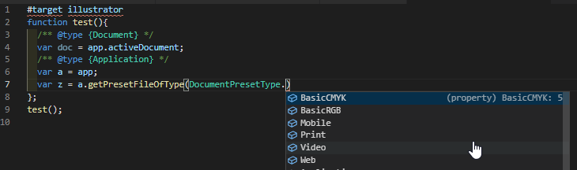

#Illustrator JSDoc VSCode Types

This project's objective is to enable non-TypeScript users to gain some benefit of VSCode's auto-completion intellisense by using JSDoc annotations.
Content from [Types for Adobe](https://github.com/bbb999/Types-for-Adobe) was processed to transform TypeScript class declarations into mock javascript classes and type definitions.

To use, simply have this document open in your VSCode workspace and auto-completion should be activated when proper annotations are being used.

> **Do NOT include the file in your code, just have it open**


_Now, simple JSDoc intellisense can empower even temporary throw-away snippets without creating a TS project and its configuration._



_No more searching a web page or PDF, for most of these long-standing last-documented in `Types for Adobe` scripting classes, enums & methods._

**Notes**:
## Inheritance
VSCode does not quite support (02/2021) class inheritance and the `@extends`/`@augments` keywords. (Also the `@returns` keyword.) Therefore, classes which extend classes are turned into an extra class suffixed with "JSDocType" and then a new `@typedef` statement is written that combines this class with the inherited class:
```
class InheritedClass {
	/** @type {string} - Sample base Property */
	baseProperty;
}

class InheritingClassJSDocType {
	/** @type {string} - Sample child-class Property */
	classProperty;
}

/**
 * @typedef { InheritedClass & InheritingClassJSDocType } InheritingClass
 */
```
Now when a variable is annotated with `@type {InheritingClass}`, its auto-completion should recognize `baseProperty`.

## Method
How is this made? A node-executable javascript file with parsing functions converts a `Types for Adobe` file to a JSDoc file by manipulating strings. It relies on common structural convention in a `Types for Adobe` **.d.ts** file, such as very consistent comments, separation of blocks by a blank line, and TS label annotation in each and every place - even `:void` as a return label for methods.

Class declarations are turned into real mock javascript classes, and function declarations are turned into real properties to facilitate JSDoc auto-completion. The method bodies are however absent. These classes are real JS constructs, however they will not be used in the code as this file will not be used in the code. Just having it open inside of VSCode creates the auto-completion feature!