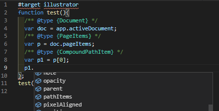

#Illustrator JSDoc VSCode Types

This project's objective is to enable non-TypeScript users to gain some benefit of VSCode's auto-completion intellisense by using JSDoc annotations.
Content from [Types for Adobe](https://github.com/bbb999/Types-for-Adobe) was processed to transform TypeScript class declarations into mock javascript classes and type definitions.

To use, simply have this document open in your VSCode workspace and auto-completion should be activated when proper annotations are being used.



**Notes**:
## Inheritance
VSCode does not quite support (02/2021) class inheritance and the `@extends`/`@augments` keywords. (Also the `@returns` keyword.) Therefore, classes which extend classes are turned into an extra class suffixed with "JSDocType" and then a new `@typedef` statement is written that combines this class with the inherited class:
```
class InheritedClass {
	/** @type {string} - Sample base Property */
	baseProperty;
}

class InheritingClassJSDocType {
	/** @type {string} - Sample child-class Property */
	classProperty;
}

/**
 * @typedef { InheritedClass & InheritingClassJSDocType } InheritingClass
 */
```
Now when a variable is annotated with `@type {InheritingClass}`, its auto-completion should recognize `baseProperty`.